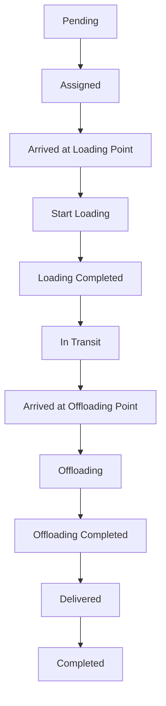

# Load Status Workflow Implementation

## Complete Status Flow



## Status Descriptions

| Status                          | Description                       | Timestamp Field                                        | Icon | Color      |
| ------------------------------- | --------------------------------- | ------------------------------------------------------ | ---- | ---------- |
| **Pending**                     | Load created, awaiting assignment | `created_at`                                           | 🕐   | Gray       |
| **Assigned**                    | Vehicle and driver assigned       | `assigned_at`                                          | ⭕   | Blue       |
| **Arrived at Loading Point**    | Vehicle reached pickup location   | `arrived_at_pickup`                                    | 📍   | Purple     |
| **Start Loading**               | Loading process begun             | `loading_started_at`                                   | ▶️   | Indigo     |
| **Loading Completed**           | All cargo loaded                  | `loading_completed_at` + `actual_pickup_datetime`      | ✅   | Teal       |
| **In Transit**                  | En route to destination           | `departure_time`                                       | 🚛   | Green      |
| **Arrived at Offloading Point** | Vehicle reached delivery location | `arrived_at_delivery`                                  | 📍   | Amber      |
| **Offloading**                  | Unloading cargo                   | `offloading_started_at`                                | 📦   | Orange     |
| **Offloading Completed**        | All cargo unloaded                | `offloading_completed_at` + `actual_delivery_datetime` | ✅   | Emerald    |
| **Delivered**                   | Delivery confirmed                | `delivered_at`                                         | ✅   | Green      |
| **Completed**                   | Load fully completed              | `completed_at`                                         | ✅   | Dark Green |

---

## Database Migration

Add these new timestamp columns to the `loads` table:

```sql
-- Add new timestamp columns for detailed workflow tracking
ALTER TABLE public.loads
ADD COLUMN IF NOT EXISTS arrived_at_pickup TIMESTAMPTZ,
ADD COLUMN IF NOT EXISTS loading_started_at TIMESTAMPTZ,
ADD COLUMN IF NOT EXISTS loading_completed_at TIMESTAMPTZ,
ADD COLUMN IF NOT EXISTS departure_time TIMESTAMPTZ,
ADD COLUMN IF NOT EXISTS arrived_at_delivery TIMESTAMPTZ,
ADD COLUMN IF NOT EXISTS offloading_started_at TIMESTAMPTZ,
ADD COLUMN IF NOT EXISTS offloading_completed_at TIMESTAMPTZ,
ADD COLUMN IF NOT EXISTS delivered_at TIMESTAMPTZ,
ADD COLUMN IF NOT EXISTS completed_at TIMESTAMPTZ;

-- Update status enum to include all workflow statuses
ALTER TABLE public.loads DROP CONSTRAINT IF EXISTS loads_status_check;
ALTER TABLE public.loads ADD CONSTRAINT loads_status_check
  CHECK (status IN (
    'Pending',
    'Assigned',
    'Arrived at Loading Point',
    'Start Loading',
    'Loading Completed',
    'In Transit',
    'Arrived at Offloading Point',
    'Offloading',
    'Offloading Completed',
    'Delivered',
    'Completed',
    'Cancelled',
    'On Hold'
  ));

-- Create index for status queries
CREATE INDEX IF NOT EXISTS idx_loads_status ON public.loads(status);
CREATE INDEX IF NOT EXISTS idx_loads_workflow_timestamps ON public.loads(
  loading_started_at,
  loading_completed_at,
  offloading_started_at,
  offloading_completed_at
);

-- Function to calculate loading duration
CREATE OR REPLACE FUNCTION calculate_loading_duration(p_load_id UUID)
RETURNS INTERVAL AS $$
DECLARE
  v_duration INTERVAL;
BEGIN
  SELECT loading_completed_at - loading_started_at
  INTO v_duration
  FROM public.loads
  WHERE id = p_load_id;

  RETURN v_duration;
END;
$$ LANGUAGE plpgsql;

-- Function to calculate offloading duration
CREATE OR REPLACE FUNCTION calculate_offloading_duration(p_load_id UUID)
RETURNS INTERVAL AS $$
DECLARE
  v_duration INTERVAL;
BEGIN
  SELECT offloading_completed_at - offloading_started_at
  INTO v_duration
  FROM public.loads
  WHERE id = p_load_id;

  RETURN v_duration;
END;
$$ LANGUAGE plpgsql;

-- Function to calculate total transit time
CREATE OR REPLACE FUNCTION calculate_transit_time(p_load_id UUID)
RETURNS INTERVAL AS $$
DECLARE
  v_duration INTERVAL;
BEGIN
  SELECT arrived_at_delivery - departure_time
  INTO v_duration
  FROM public.loads
  WHERE id = p_load_id;

  RETURN v_duration;
END;
$$ LANGUAGE plpgsql;

GRANT EXECUTE ON FUNCTION calculate_loading_duration(UUID) TO authenticated;
GRANT EXECUTE ON FUNCTION calculate_offloading_duration(UUID) TO authenticated;
GRANT EXECUTE ON FUNCTION calculate_transit_time(UUID) TO authenticated;

-- Create view for workflow analytics
CREATE OR REPLACE VIEW load_workflow_analytics AS
SELECT
  id,
  load_number,
  status,
  customer_name,

  -- Duration calculations
  EXTRACT(EPOCH FROM (loading_completed_at - loading_started_at)) / 60 AS loading_duration_minutes,
  EXTRACT(EPOCH FROM (arrived_at_delivery - departure_time)) / 60 AS transit_duration_minutes,
  EXTRACT(EPOCH FROM (offloading_completed_at - offloading_started_at)) / 60 AS offloading_duration_minutes,
  EXTRACT(EPOCH FROM (completed_at - created_at)) / 60 AS total_duration_minutes,

  -- Timestamps
  created_at,
  assigned_at,
  arrived_at_pickup,
  loading_started_at,
  loading_completed_at,
  departure_time,
  arrived_at_delivery,
  offloading_started_at,
  offloading_completed_at,
  delivered_at,
  completed_at,

  -- Check if behind schedule
  CASE
    WHEN arrived_at_delivery > delivery_datetime THEN true
    ELSE false
  END AS is_delayed,

  EXTRACT(EPOCH FROM (delivery_datetime - arrived_at_delivery)) / 60 AS time_variance_minutes

FROM public.loads
WHERE status IN (
  'Loading Completed',
  'In Transit',
  'Arrived at Offloading Point',
  'Offloading',
  'Offloading Completed',
  'Delivered',
  'Completed'
);

GRANT SELECT ON load_workflow_analytics TO authenticated;
```

---

## Usage

### 1. Basic Usage in LiveDeliveryTracking

```typescript
import { LoadStatusWorkflow } from "@/components/loads/LoadStatusWorkflow";

// In your LiveDeliveryTracking component
<LoadStatusWorkflow
  loadId={loadId}
  currentStatus={load.status}
  loadNumber={load.load_number}
/>;
```

### 2. Manual Status Update (API/Backend)

```typescript
// Update status via Supabase
const updateLoadStatus = async (loadId: string, newStatus: LoadStatus) => {
  const updateData: Record<string, unknown> = {
    status: newStatus,
    updated_at: new Date().toISOString(),
  };

  // Add appropriate timestamp
  if (newStatus === "Start Loading") {
    updateData.loading_started_at = new Date().toISOString();
  }

  const { data, error } = await supabase
    .from("loads")
    .update(updateData)
    .eq("id", loadId)
    .select()
    .single();

  return { data, error };
};
```

### 3. Automated Status Updates (Geofence-based)

```typescript
// In useGeofenceMonitoring hook
useEffect(() => {
  const handleGeofenceEntry = async (event: GeofenceEvent) => {
    const load = await getLoadByVehicle(event.vehicle_id);

    if (event.geofence_type === "pickup" && load.status === "Assigned") {
      // Auto-update to "Arrived at Loading Point"
      await updateLoadStatus(load.id, "Arrived at Loading Point");
    }

    if (event.geofence_type === "delivery" && load.status === "In Transit") {
      // Auto-update to "Arrived at Offloading Point"
      await updateLoadStatus(load.id, "Arrived at Offloading Point");
    }
  };
}, []);
```

### 4. Mobile Driver App Integration

```typescript
// Mobile app buttons for driver
const DriverActionButtons = ({ load }) => {
  return (
    <div className="space-y-3">
      {load.status === "Arrived at Loading Point" && (
        <Button onClick={() => updateStatus("Start Loading")}>
          ▶️ Start Loading
        </Button>
      )}

      {load.status === "Start Loading" && (
        <Button onClick={() => updateStatus("Loading Completed")}>
          ✅ Loading Complete
        </Button>
      )}

      {load.status === "Loading Completed" && (
        <Button onClick={() => updateStatus("In Transit")}>🚛 Depart</Button>
      )}

      {load.status === "Arrived at Offloading Point" && (
        <Button onClick={() => updateStatus("Offloading")}>
          📦 Start Offloading
        </Button>
      )}

      {load.status === "Offloading" && (
        <Button onClick={() => updateStatus("Offloading Completed")}>
          ✅ Offloading Complete
        </Button>
      )}
    </div>
  );
};
```

---

## Status Transition Rules

### Automatic Transitions

- **Geofence Entry (Pickup)** → `Arrived at Loading Point`
- **Geofence Entry (Delivery)** → `Arrived at Offloading Point`

### Manual Confirmation Required

- `Start Loading` ✓
- `Loading Completed` ✓
- `Offloading` ✓
- `Offloading Completed` ✓

### Validation Rules

- Cannot skip statuses (must follow sequence)
- Timestamps must be chronological
- Vehicle must be assigned before any location-based status

---

## Real-Time Notifications

When status changes, the following happen automatically:

1. **Toast Notification**

   ```
   ✅ Status Updated
   Load LD-20251111-797 → Start Loading
   ```

2. **Timeline Update**

   - New entry in LoadUpdateTimeline
   - Shows status change with timestamp

3. **UI Refresh**

   - React Query invalidates `['loads']` and `['load', loadId]`
   - All components refresh automatically

4. **Database Trigger** (optional)

   ```sql
   -- Send notification to stakeholders
   CREATE OR REPLACE FUNCTION notify_status_change()
   RETURNS TRIGGER AS $$
   BEGIN
     IF NEW.status != OLD.status THEN
       -- Send to notification system
       INSERT INTO notifications (load_id, type, message)
       VALUES (
         NEW.id,
         'status_change',
         'Load ' || NEW.load_number || ' status changed to ' || NEW.status
       );
     END IF;
     RETURN NEW;
   END;
   $$ LANGUAGE plpgsql;

   CREATE TRIGGER load_status_change_trigger
     AFTER UPDATE ON loads
     FOR EACH ROW
     EXECUTE FUNCTION notify_status_change();
   ```

---

## Analytics & Reporting

### Get Load Duration Metrics

```typescript
const { data: metrics } = useQuery({
  queryKey: ["load-metrics", loadId],
  queryFn: async () => {
    const { data } = await supabase
      .from("load_workflow_analytics")
      .select("*")
      .eq("id", loadId)
      .single();

    return data;
  },
});

// Display metrics
console.log("Loading Duration:", metrics.loading_duration_minutes, "min");
console.log("Transit Duration:", metrics.transit_duration_minutes, "min");
console.log("Offloading Duration:", metrics.offloading_duration_minutes, "min");
console.log("Total Duration:", metrics.total_duration_minutes, "min");
console.log("Delayed:", metrics.is_delayed);
```

### Average Performance by Route

```sql
SELECT
  origin,
  destination,
  COUNT(*) AS total_loads,
  AVG(loading_duration_minutes) AS avg_loading_time,
  AVG(transit_duration_minutes) AS avg_transit_time,
  AVG(offloading_duration_minutes) AS avg_offloading_time,
  AVG(total_duration_minutes) AS avg_total_time,
  ROUND(AVG(CASE WHEN is_delayed THEN 1 ELSE 0 END) * 100, 2) AS delay_percentage
FROM load_workflow_analytics
WHERE status = 'Completed'
GROUP BY origin, destination
ORDER BY total_loads DESC;
```

---

## Testing Checklist

- [ ] Apply database migration
- [ ] Test status progression (Pending → Completed)
- [ ] Verify timestamps are set correctly
- [ ] Confirm real-time notifications appear
- [ ] Test manual status updates
- [ ] Test geofence auto-updates
- [ ] Verify duration calculations
- [ ] Check analytics view data
- [ ] Test "require confirmation" prompts
- [ ] Verify cannot skip statuses

---

## Integration with Existing Features

### 1. Wialon GPS Tracking

- Auto-detect arrival at geofences
- Update status automatically

### 2. Geofence System

- Pickup geofence entry → "Arrived at Loading Point"
- Delivery geofence entry → "Arrived at Offloading Point"

### 3. Real-Time Updates

- Status changes trigger Supabase real-time events
- useLoadRealtime hook shows toast notifications
- LoadUpdateTimeline displays change history

### 4. LiveDeliveryTracking

- Displays current status workflow
- Shows next action button
- Tracks timestamps for each stage

---

## Summary

**Status Flow:**

```
Pending → Assigned → Arrived at Loading Point → Start Loading →
Loading Completed → In Transit → Arrived at Offloading Point →
Offloading → Offloading Completed → Delivered → Completed
```

**Key Features:**

- ✅ Visual timeline with progress indicators
- ✅ One-click status advancement
- ✅ Automatic timestamp recording
- ✅ Real-time notifications
- ✅ Duration analytics
- ✅ Geofence integration
- ✅ Mobile-friendly buttons

**Next Steps:**

1. Apply database migration
2. Add LoadStatusWorkflow component to LiveDeliveryTracking
3. Test status progression
4. Integrate with geofence system for auto-updates
