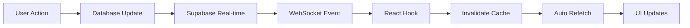

# Real-time Features Usage Guide

## Overview

Your application has full real-time capabilities using Supabase real-time subscriptions. Changes made by any user are instantly reflected across all connected clients without page refreshes.

## Available Real-time Hooks

The application includes standardized real-time hooks for different data domains:

### Vehicle & Tyre Management
- **`useRealtimeVehicles()`** - Monitors the `vehicles` table
- **`useRealtimeTyres()`** - Monitors multiple tyre-related tables: `tyres`, `tyre_inventory`, `tyre_inspections`, `tyre_positions`
- **`useRealtimeVehicleFaults()`** - Monitors vehicle faults
- **`useRealtimeDriverBehaviorEvents()`** - Monitors driver behavior events

### Operations Management
- **`useRealtimeTrips()`** - Monitors trip data changes
- **`useRealtimeCostEntries()`** - Monitors cost entry changes
- **`useRealtimeActionItems()`** - Monitors action items
- **`useRealtimeCARReports()`** - Monitors CAR (Corrective Action Request) reports
- **`useRealtimeMissedLoads()`** - Monitors missed load tracking

### Fuel Management
- **`useRealtimeDieselRecords()`** - Monitors diesel fuel records
- **`useRealtimeDieselNorms()`** - Monitors diesel consumption norms
- **`useRealtimeDriverBehavior()`** - Monitors driver behavior metrics

## How It Works

1. **Component mounts** → Hook subscribes to database changes via WebSocket
2. **Data changes in database** → Supabase sends update event
3. **Hook receives event** → Invalidates React Query cache for affected queries
4. **React Query refetches** → UI updates automatically with fresh data



## Usage Examples

### Example 1: Using in OperationsContext

The `OperationsContext` demonstrates the pattern of using multiple hooks together:

```typescript
import { useRealtimeTrips } from "@/hooks/useRealtimeTrips";
import { useRealtimeCostEntries } from "@/hooks/useRealtimeCostEntries";
import { useRealtimeActionItems } from "@/hooks/useRealtimeActionItems";

export const OperationsProvider = ({ children }: OperationsProviderProps) => {
  // Enable real-time updates for all operations data
  useRealtimeTrips();
  useRealtimeCostEntries();
  useRealtimeActionItems();
  useRealtimeCARReports();
  useRealtimeMissedLoads();
  useRealtimeDieselRecords();
  useRealtimeDieselNorms();
  useRealtimeDriverBehavior();

  // ... rest of context logic
};
```

### Example 2: Dashboard with Live Vehicle Updates

```typescript
import { useRealtimeVehicles } from "@/hooks/useRealtimeVehicles";
import { useQuery } from "@tanstack/react-query";
import { supabase } from "@/integrations/supabase/client";

const VehicleDashboard = () => {
  useRealtimeVehicles(); // Enable real-time

  const { data: vehicles } = useQuery({
    queryKey: ["vehicles"],
    queryFn: async () => {
      const { data, error } = await supabase
        .from("vehicles")
        .select("*")
        .order("created_at", { ascending: false });
      
      if (error) throw error;
      return data;
    },
  });

  return (
    <div>
      {vehicles?.map(vehicle => (
        <VehicleCard key={vehicle.id} vehicle={vehicle} />
      ))}
    </div>
  );
};
```

### Example 3: Trip Management with Real-time Cost Updates

```typescript
import { useRealtimeTrips } from "@/hooks/useRealtimeTrips";
import { useRealtimeCostEntries } from "@/hooks/useRealtimeCostEntries";

const TripManagement = () => {
  useRealtimeTrips();
  useRealtimeCostEntries();

  const { data: trips } = useQuery({
    queryKey: ["trips", "active"],
    queryFn: async () => {
      const { data, error } = await supabase
        .from("trips")
        .select(`
          *,
          cost_entries(*)
        `)
        .eq("status", "active");
      
      if (error) throw error;
      return data;
    },
  });

  // Automatically updates when trips or costs change
  return <TripList trips={trips} />;
};
```

## Creating Custom Real-time Hooks

All hooks follow a standardized pattern. Here's a template for creating new ones:

```typescript
// src/hooks/useRealtimeYourTable.ts
import { useEffect } from "react";
import { supabase } from "@/integrations/supabase/client";
import { useQueryClient } from "@tanstack/react-query";

export const useRealtimeYourTable = () => {
  const queryClient = useQueryClient();

  useEffect(() => {
    const channel = supabase
      .channel("your-table-changes")
      .on(
        "postgres_changes",
        {
          event: "*", // Listen to INSERT, UPDATE, DELETE
          schema: "public",
          table: "your_table_name",
        },
        () => {
          // Invalidate all queries that use this table
          queryClient.invalidateQueries({ queryKey: ["your_table"] });
        }
      )
      .subscribe();

    return () => {
      supabase.removeChannel(channel);
    };
  }, [queryClient]);
};
```

### Hook Naming Convention

- Use prefix `useRealtime`
- Follow with the table/domain name in PascalCase
- Examples: `useRealtimeVehicles`, `useRealtimeCostEntries`, `useRealtimeActionItems`

## Advanced Usage

### Listening to Specific Events Only

```typescript
// Only listen to new records
.on(
  "postgres_changes",
  {
    event: "INSERT",
    schema: "public",
    table: "vehicles",
  },
  (payload) => {
    console.log("New vehicle added:", payload.new);
  }
)

// Only listen to updates
.on(
  "postgres_changes",
  {
    event: "UPDATE",
    schema: "public",
    table: "tyres",
  },
  (payload) => {
    console.log("Tyre updated:", payload.new);
  }
)
```

### Filtering Real-time Events

```typescript
// Only get changes for specific records
.on(
  "postgres_changes",
  {
    event: "*",
    schema: "public",
    table: "trips",
    filter: "status=eq.active",
  },
  (payload) => {
    console.log("Active trip changed");
  }
)
```

### Targeted Cache Invalidation

```typescript
export const useRealtimeTrips = () => {
  const queryClient = useQueryClient();

  useEffect(() => {
    const channel = supabase
      .channel("trips-changes")
      .on(
        "postgres_changes",
        {
          event: "*",
          schema: "public",
          table: "trips",
        },
        (payload) => {
          // Invalidate specific queries
          queryClient.invalidateQueries({ queryKey: ["trips"] });
          queryClient.invalidateQueries({ queryKey: ["active_trips"] });
          queryClient.invalidateQueries({ queryKey: ["completed_trips"] });
          
          // Or invalidate based on the changed record
          if (payload.new?.id) {
            queryClient.invalidateQueries({ 
              queryKey: ["trip", payload.new.id] 
            });
          }
        }
      )
      .subscribe();

    return () => {
      supabase.removeChannel(channel);
    };
  }, [queryClient]);
};
```

## Performance Best Practices

### 1. Use Hooks at the Right Level
Place hooks at the layout or context level, not in every component:

```typescript
// ❌ Bad: Hook in every component
function Component1() {
  useRealtimeVehicles(); // Creates subscription
  // ...
}

function Component2() {
  useRealtimeVehicles(); // Creates another subscription
  // ...
}

// ✅ Good: Hook at layout/context level
function Layout() {
  useRealtimeVehicles(); // Single subscription
  return (
    <>
      <Component1 />
      <Component2 />
    </>
  );
}
```

### 2. Combine Related Hooks

When components need multiple data types, use all relevant hooks together:

```typescript
const TyreManagement = () => {
  useRealtimeTyres();           // Tyre data
  useRealtimeVehicles();        // Vehicle associations
  useRealtimeVehicleFaults();   // Related faults
  
  // All three will update when their data changes
};
```

### 3. Use React Query Caching

React Query prevents unnecessary refetches by caching data:

```typescript
const { data: vehicles } = useQuery({
  queryKey: ["vehicles"],
  queryFn: fetchVehicles,
  staleTime: 5 * 60 * 1000, // 5 minutes
});
```

### 4. Clean Up Subscriptions

Hooks automatically clean up on unmount - no manual cleanup needed.

## Testing Real-time Features

### Multi-Browser Test

1. Open your app in Chrome
2. Open your app in Firefox (or Chrome Incognito)
3. Log in to both sessions
4. Make changes in one browser
5. Watch updates appear instantly in the other

### Test Scenarios

- ✅ Add a new trip → Should appear in all clients immediately
- ✅ Update cost entry → Cost lists should update everywhere
- ✅ Complete inspection → Status changes for all users
- ✅ Delete a record → Disappears from all clients
- ✅ Update vehicle fault → Fault status syncs across dashboards

## Troubleshooting

### Real-time not working?

1. **Check subscription status**:
```typescript
const channel = supabase.channel("test");
channel.subscribe((status) => {
  console.log("Subscription status:", status);
});
```

2. **Verify table is published**:
```sql
SELECT * FROM pg_publication_tables 
WHERE pubname = 'supabase_realtime';
```

3. **Check browser console** for WebSocket errors

4. **Verify authentication** - Real-time requires valid session

### Events not firing?

- Ensure RLS policies allow the operation
- Verify user is authenticated
- Check that the table has realtime enabled

## Real-time Event Payload Structure

```typescript
{
  schema: "public",
  table: "trips",
  commit_timestamp: "2024-01-15T10:30:00Z",
  eventType: "INSERT", // or UPDATE, DELETE
  new: {
    // New record data (INSERT, UPDATE)
    id: "...",
    trip_number: "T-001",
    // ... other fields
  },
  old: {
    // Old record data (UPDATE, DELETE)
  },
  errors: null
}
```

## When to Create New Hooks

Create a new real-time hook when:
- You add a new table that needs live updates
- Multiple components need to react to the same table changes
- You want to isolate domain-specific real-time logic

Don't create a hook if:
- Only one component needs the updates (use inline subscription)
- The data rarely changes and doesn't need instant updates
- The table is only used for lookups/configuration

---

Your app now has powerful real-time capabilities that make it feel instant and collaborative! 🚀
